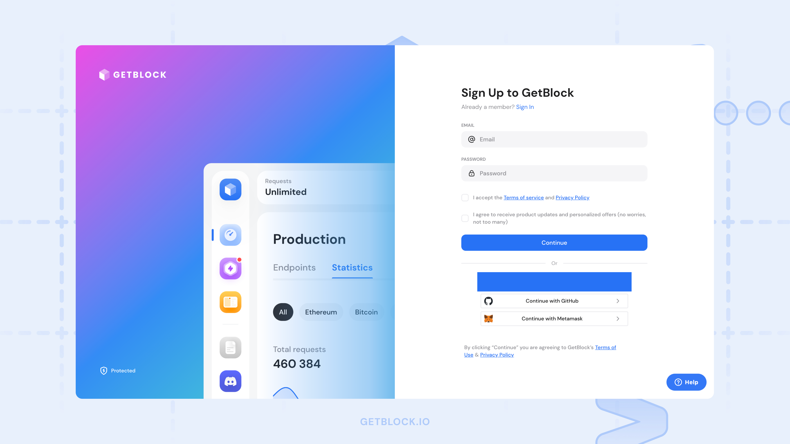

# Welcome

With our tools and services, you can focus on building your Web3 project without worrying about the technical details of setting up and managing blockchain nodes.

From DeFi apps and NFT platforms to analytics tools, AppChains, and more, GetBlock provides the infrastructure to help you build, test, and scale your blockchain-powered solutions.

***

### Core GetBlock features

*   **Plug-and-Play access**

    Our ready-to-use blockchain nodes and APIs help you get started immediately.
* **99.9% uptime**\
  Reliable 24/7 connection to multiple blockchain networks.
*   **Multi-chain support**

    Connect to Bitcoin, Ethereum, BNB Chain, Polygon, Solana, TON, and 50+ other networks. (And we support new protocols before anyone else!)
*   **Flexible plans**

    From free access to enterprise-grade solutions, we’ve got options for every stage of your project.
*   **Custom solutions** 

    Need something unique? We can build tailored solutions for your specific blockchain needs.
*   **24/7 Expert support**

    Our team is here to help with integrations, troubleshooting, and scaling.

***

<figure><figcaption></figcaption></figure>

***

## Discover GetBlock

<table data-card-size="large" data-view="cards"><thead><tr><th></th><th></th><th></th><th data-hidden data-card-cover data-type="files"></th><th data-hidden data-card-target data-type="content-ref"></th></tr></thead><tbody><tr><td><mark style="color:blue;"><strong>Getting Started</strong></mark></td><td>Create your account, explore plans &#x26; features, and make your first API call</td><td></td><td><a href=".gitbook/assets/getingstarted (1).png">getingstarted (1).png</a></td><td><a href="getting-started/how-to-set-up-an-account.md">how-to-set-up-an-account.md</a></td></tr><tr><td><mark style="color:blue;"><strong>Guides</strong></mark></td><td>Set up endpoints, manage access tokens, and integrate GetBlock APIs step-by-step</td><td></td><td><a href=".gitbook/assets/guides (1).png">guides (1).png</a></td><td><a href="guides/endpoint-setup/">endpoint-setup</a></td></tr><tr><td><mark style="color:blue;"><strong>API Reference</strong></mark></td><td>View supported networks, available endpoints, and full API specifications</td><td></td><td><a href=".gitbook/assets/api reference (1).png">api reference (1).png</a></td><td><a href="api-reference/overview.md">overview.md</a></td></tr><tr><td><mark style="color:blue;"><strong>Explorer API</strong></mark></td><td>Track transactions and monitor network activity with real-time blockchain data</td><td></td><td><a href=".gitbook/assets/explorer api (1).png">explorer api (1).png</a></td><td></td></tr></tbody></table>

***

## Popular chains

Get started with our most in-demand blockchain networks.&#x20;

|   [**Ethereum**](api-reference/ethereum-eth/)                                |   [**Tron**](api-reference/tron-trx/)                  |   [**Arbitrum**](api-reference/arbitrum-arb/) |
| ----------------------------------------------------------------------------------------------------------------------------------------------------------------------------------------- | ------------------------------------------------------------------------------------------------------------------------------------------------------ | ----------------------------------------------------------------------------------------------------------------------------------------------------- |
|   [**BNB Smart Chain**](api-reference/binance-smart-chain-bsc/) |   [**Solana**](api-reference/solana-sol/)          |   [**Optimism**](api-reference/optimism-op/)         |
|   [**Polygon**](api-reference/polygon-matic/)                                     |   [**Avalanche**](api-reference/avalanche-avax/) |   [**Base**](api-reference/ethereum-eth/)         |

***

## GetBlock Product Demo


GetBlock Product Demo

