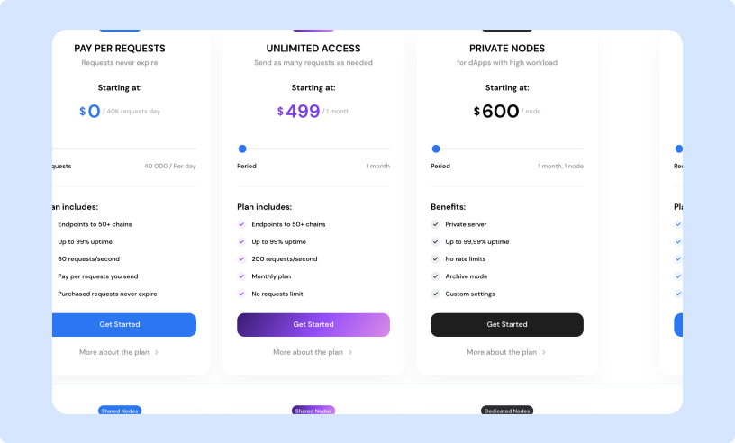

# Choosing your plan

You can explore different pricing and plans from your dashboard in the “Pricing” section or via [https://getblock.io/pricing/](https://getblock.io/pricing/).&#x20;

<figure><figcaption>
GetBlock node service options
</figcaption></figure>

### Shared nodes

Shared nodes use a “shared” infrastructure model, where the resources of a node are accessed and used by multiple clients.&#x20;

This option is perfect for individual developers and teams starting out or looking for a budget-friendly way to connect to multiple blockchains.

### Dedicated nodes

Dedicated nodes are private nodes deployed exclusively for your use.

This option is perfect for applications managing high traffic volumes or platforms that need a flawless connection to the blockchain without limits.&#x20;

* Unlimited access.
* High reliability with 99.9% uptime.
* Access to archive nodes.
* Custom node configurations.

### Enterprise solutions

This option is designed to meet the needs of organizations operating at scale or applications that require extra resources, features, and dedicated support.

What’s included:&#x20;

* 99.9% uptime guarantee
* Customizable node configurations and integrations
* Performance optimization via load balancers&#x20;
* Advanced analytics and alert systems
* Priority assistance from GetBlock experts

To explore Enterprise Solutions and contact our team visit [https://getblock.io/enterprise-api/](https://getblock.io/enterprise-api/).&#x20;
