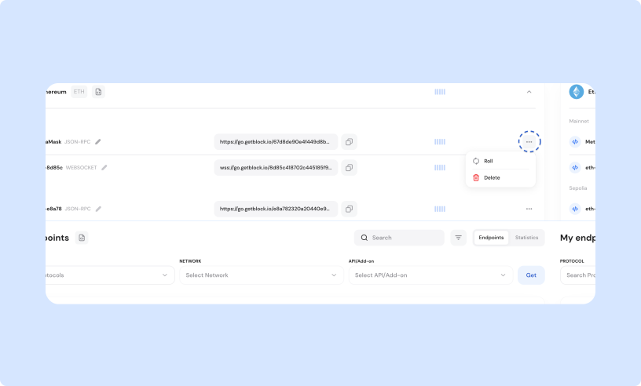

# 🔑 Access Token management

Every endpoint you create is assigned a unique access token:

```
https://go.getblock.io/<ACCESS_TOKEN>/
```

The \<ACCESS\_TOKEN> authenticates requests directly through the endpoint URL.

### Making an authenticated request

To make a request, include your full endpoint URL with the access token in the path.


Access tokens cannot be sent in headers.


For example, here’s how to fetch the latest Ethereum block number:

```bash
curl --location --request POST 'https://go.getblock.io/<ACCESS-TOKEN>/' \
--header 'Content-Type: application/json' \
--data-raw '{
    "jsonrpc": "2.0",
    "method": "eth_blockNumber",
    "params": [],
    "id": "getblock.io"
}'
```

Response:

```json
{"jsonrpc":"2.0","id":"getblock.io","result":"0x1449641"}
```

### Access Token security

Always store your access tokens securely. Avoid exposing them in publicly accessible code repositories or logs.

If a token is compromised, you can quickly roll or delete it without disrupting other endpoints:

1. Go to your GetBlock Dashboard.
2. Locate the endpoint associated with the token.
3. Click the  next to the endpoint.
4. Select the option to either **roll** (regenerate) or **delete** the token.

<figure><figcaption><p>Regenerate or delete yur access token</p></figcaption></figure>

This authentication method ensures that all your interactions with GetBlock’s services remain secure, reliable, and easy to manage.
