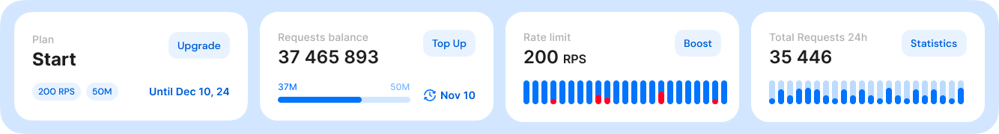
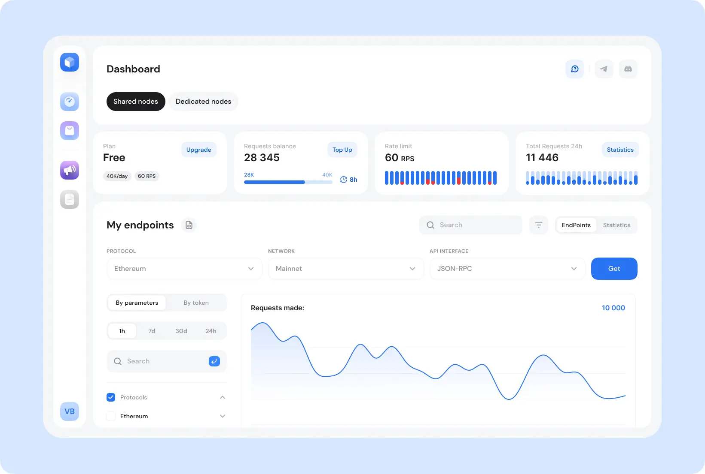
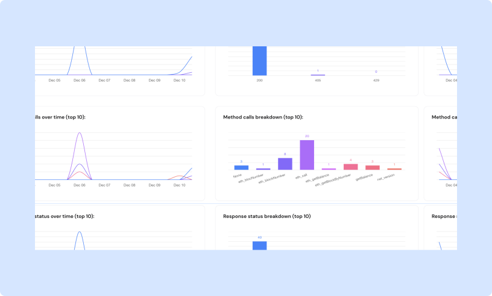
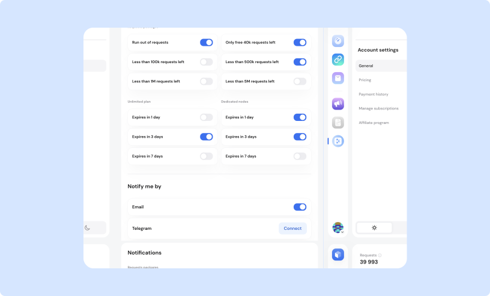

# 📈 Monitoring and analytics

These tools help ensure optimal use of GetBlock’s services and keep you informed of key metrics and events related to your account.

### Dashboard

<figure><figcaption>
User dashboard shows a quick overview of key metrics
</figcaption></figure>

The Dashboard provides a quick snapshot of key metrics:

* Your current plan details
* Remaining request balance
* Rate limit based on your plan
* Total requests made in the last 24 hours

### Detailed statistics

For more detailed analysis, visit the **Statistics** tab in the ‘My Endpoints’ section.


Customize the data view by parameters or by access token using the dropdown menu.


Select the time period, protocol name, networks (mainnet/testnet), and API interfaces to analyze the data by parameters.

<figure><figcaption>
The Statistics tab shows in-depth and customizable data analysis for your endpoints
</figcaption></figure>

All data is displayed through infographics, including:

* Number of requests
* Response statuses
* Method call distribution
* Rate limit rejections

<figure><figcaption>
Visual analytics
</figcaption></figure>

### Notifications

GetBlock provides a notification system to help you monitor your usage and subscription status.


You can set up alerts for both request packages and subscription expirations.


Alert types:

* **Run out of requests:** Notifies you when your request balance reaches zero.
* **Request balance alerts**: Warns when remaining requests drop below drop below specified limits.
* **Subscription expiration alerts**: Help you renew your plans on time.

<figure><figcaption>
Set up notifications to monitor your usage and subscription status
</figcaption></figure>

Configure how to receive these alerts in your Account Settings.
