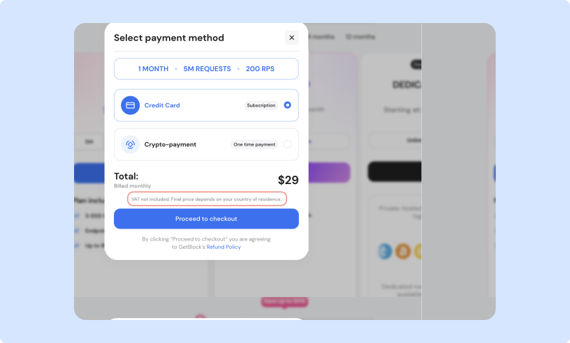
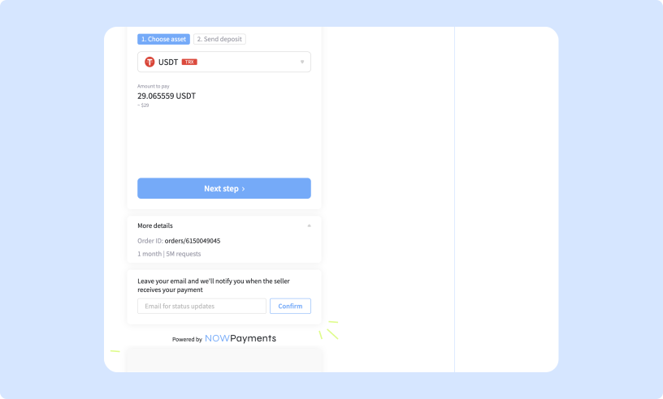

# Payment methods

### Fiat payments

Users can pay for subscriptions using traditional fiat currency via **Paddle**.

**How it works:**

* **Recurring payments enabled by default**: Payment is automatically deducted on the billing date.
* **Fees**: VAT is applied to Paddle payments and varies depending on your region
* **If the card balance is insufficient**: GetBlock will retry the payment after three days. If the retry fails, requests will be frozen until the payment is resolved.

<figure><figcaption>
Selecting fiat as a payment method
</figcaption></figure>


Please, account for VAT when planning your payments.


#### Updating your payment details

To update your payment information while you have an active subscription:

1. Go to Account Settings → Manage Subscriptions.
2. Click ‘Edit Payment Method’.
3. Enter your updated payment details and save the changes.

***

### Crypto payments

Users can top up their accounts with cryptocurrency through **NOWPayments**.

**How it works**

* Payments are processed as one-time transactions: add funds as needed.
* Supported cryptocurrencies: any token on any network available through NOWPayments at the time of payment.
* Fees: blockchain network fees apply.

<figure><figcaption>
Crypto payments
</figcaption></figure>


If the network fees are insufficient or the transaction fails, the payment will not be processed and the subscription plan will not be activated. **Please, include enough gas fees to ensure the transaction processes successfully**.

