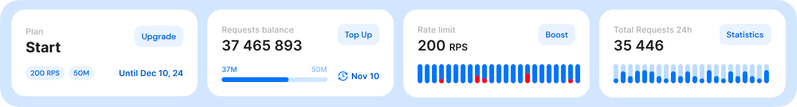

# Request and rate limits

<figure><figcaption>
Feature comparison of shared nodes vs dedicated nodes
</figcaption></figure>

Please, navigate to [https://getblock.io/pricing/ ](https://getblock.io/pricing/)to see the full comparison table.

***

### Shared node limits

<figure><figcaption>
Shared node plans
</figcaption></figure>

#### 1) Free plan

* Requests: 40,000 per day per account.
* Rate: 60 requests per second (RPS).


Requests are renewed daily, but unused requests cannot be transferred to the next day.


Clients who want to increase their usage limits can choose between the options below.

#### 2) Start plan

This is a monthly subscription based on the number of requests you need.

* Requests: from 5 to 100 million per month.
* Rate: 200 requests per second (RPS).
* You can buy extra request packages if needed.


If you don’t use all your allocated requests within a month, the unused requests will carry over to the next month as long as your subscription is active and renewed.


<figure><figcaption>
Start plan user dashboard
</figcaption></figure>

> If Alice subscribes to a one-month plan with 50 million requests starting on November 10, the plan will expire on December 10. Any unused requests will be available again only after she renews her subscription for the next period.
>
> Additionally, if Alice finds that 50 million requests are insufficient for her needs, she can purchase additional request packages directly from her dashboard.

Here is the calculation that helps to determine the time during which the whole amount of requests from the “Start” subscription will be spent at a maximum capacity set to 200 requests per second (RpS):

* 5,000,000 requests / (200 RpS \* 60 sec) = 416 min (or 6 hrs 57 min);
* 10,000,000 requests / (200 RpS \* 60 sec) = 833 min (or 13 hrs 53 min);
* 50,000,000 requests / (200 RpS \* 60 sec) = 4166 min (or 69 hrs 27 min);
* 100,000,000 requests / (200 RpS \* 60 sec) = 8332 min (or 138 hrs 54 min).


Your balance of requests for shared nodes is distributed on all endpoints added under the ‘Shared nodes’ tab.


#### 3) Unlimited plan

<figure><figcaption>
Unlimited plan user dashboard
</figcaption></figure>

This is a monthly subscription with no limit on the number of requests on all shared nodes for 1, 3, 6, 9, or 12 months.

* Requests: unlimited.
* Default rate: 300 requests per second (RPS).

***

### Dedicated node limits

<figure><figcaption>
Dedicated node features
</figcaption></figure>

* Requests: unlimited
* Rate: unlimited (1000+ requests/sec depending on a blockchain).
