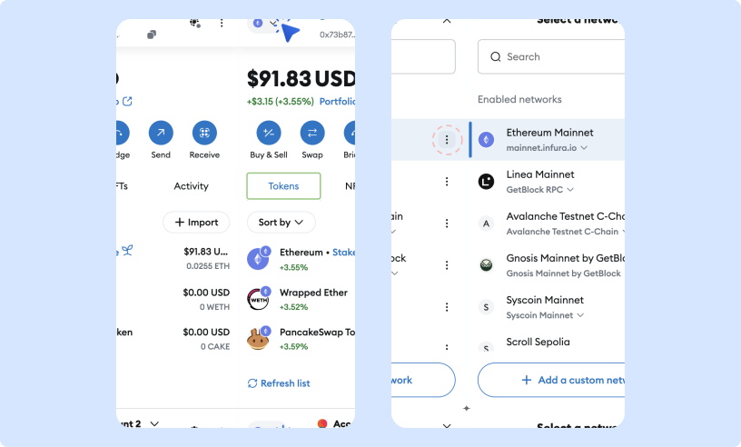
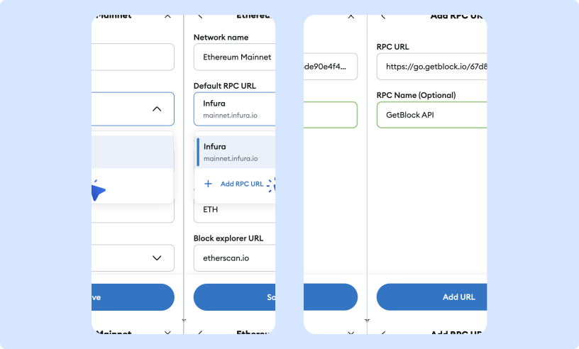
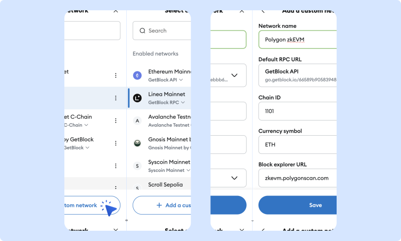

# Connect to GetBlock with MetaMask

MetaMask is a blockchain wallet available as a mobile application and a browser extension. It allows you to interact with Ethereum-based decentralized applications (dApps) directly from your browser.&#x20;


Using GetBlock nodes with MetaMask makes your blockchain experience faster and more reliable than using default RPCs:

* Connect directly to trusted nodes for secure transactions.
* Enjoy quicker transactions and smoother dApp interactions.
* Experience less downtime, even during busy network periods


This step-by-step tutorial will guide you through connecting GetBlock’s powerful nodes to your MetaMask wallet.

***

### Before you start

#### Set up your wallet

If you don’t already have MetaMask, download and install it from the official website: [https://metamask.io/download](https://metamask.io/download).&#x20;

MetaMask extension is officially supported on Chrome, Brave, Firefox, Microsoft Edge, and Opera browsers.&#x20;

#### Get a custom RPC URL

Generate a JSON-RPC URL for the selected network from your GetBlock [account](https://getblock.io/) and copy it.

<figure><figcaption><p>Generate an RPC URL for MetaMask</p></figcaption></figure>


Rename your generated endpoints to clearly indicate their purpose.


***

### Add GetBlock RPC to an existing network

If the network is already in your list but uses a default RPC provider, you can switch to GetBlock by following these steps:

1. Click on the current network name in MetaMask to open the dropdown of networks.
2. Find the network you want to edit and click the settings menu next to it. Select 'Edit'.

<figure><figcaption></figcaption></figure>

3. Open the ‘Default RPC URL’ dropdown and select **Add RPC URL**.
4. Paste the JSON-RPC  endpoint URL from your GetBlock account (`https://go.getblock.io/<ACCESS_TOKEN>/`).&#x20;
5. Name the new RPC URL for easier identification.

<figure><figcaption></figcaption></figure>

6. Click 'Add URL', then 'Save' to confirm.

You can now switch between RPC URLs for that network as needed.

***

### Add a new network to MetaMask

If the network isn’t in your list, you can add it as a custom network. For this example, we will add the Polygon zkEVM to MetaMask.

1. Click on the current network name.
2. Select 'Add a custom network'.

<figure><figcaption></figcaption></figure>

3. Fill in the required fields:

<table><thead><tr><th width="147">Field</th><th width="256">Description</th><th width="353">Example</th></tr></thead><tbody><tr><td><strong>RPC URL</strong></td><td>The network's JSON-RPC URL from your GetBlock account </td><td><em><mark style="color:blue;">https://go.getblock.io/&#x3C;ACCESS_TOKEN>/</mark></em></td></tr><tr><td><strong>Chain ID</strong></td><td>The ID of the network</td><td><em><mark style="color:blue;">1101</mark></em></td></tr><tr><td><strong>Network name</strong></td><td>Fetched automatically based on Chain ID</td><td><em><mark style="color:blue;">Polygon zkEVM</mark></em></td></tr><tr><td><strong>Currency symbol</strong></td><td>Suggested automatically based on Chain ID</td><td><em><mark style="color:blue;">ETH</mark></em></td></tr><tr><td><strong>Block explorer URL</strong></td><td>Optional field</td><td><em><mark style="color:blue;">https://zkevm.polygonscan.com/</mark></em> </td></tr></tbody></table>


You can get the Chain ID of an EVM-compatible network  (e.g. Polygon zkEVM) sending a request to your endpoint with this curl command:

```bash
curl --location --request POST 'https://go.getblock.io/<ACCESS-TOKEN>/' \
  --header 'Content-Type: application/json' \
  --data-raw '{
    "jsonrpc": "2.0",
    "method": "eth_chainId",
    "params": [],
    "id": "getblock.io"
  }'
```


Click 'Save', and the custom network will be added and selected as default.
