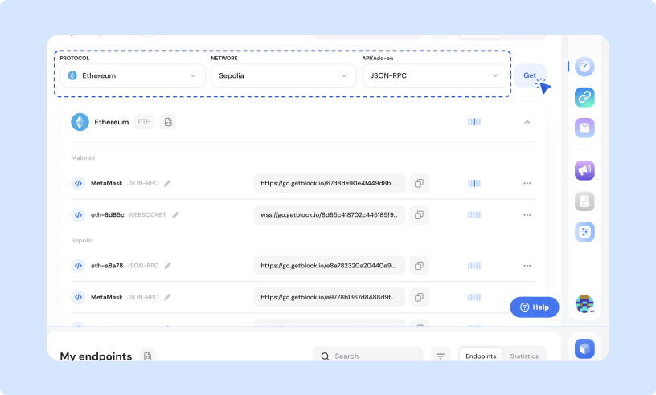

# Creating node endpoints



Log in to your GetBlock account and navigate to the **Dashboard**.



Scroll down to find the **My Endpoints** section on the Dashboard.



Choose the desired blockchain protocol (e.g., Ethereum, BNB Chain, Polygon).



Select the specific network you want to interact with (mainnet or testnet).



Pick the API method that you need (e.g., JSON-RPC, WebSockets, GraphQL, etc).



Click 'Get' and have the endpoint URL with an access token generated.&#x20;



<figure><figcaption>
How to generate an access token
</figcaption></figure>

Generate and add as many access tokens as required for this protocol. Each token is a unique endpoint for you and your application to interact with the blockchain.

### Viewing and managing access tokens

* To see all the access tokens generated for a specific protocol, simply expand the endpoint.
* Each protocol has a configuration file that includes all relevant access token details.
* The All Access Tokens Configuration file is located next to the My Endpoints section. Use it to review and manage your tokens.

