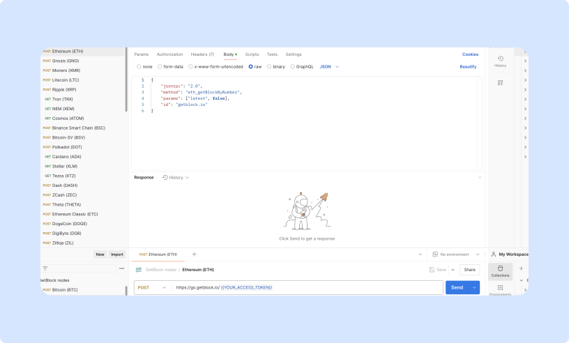

# Postman Collection

Import the collection into your Postman workspace: [https://documenter.getpostman.com/view/28751185/2s9YRDzqcX](https://documenter.getpostman.com/view/28751185/2s9YRDzqcX).

1. Once the page loads, you'll find a 'Run in Postman' button in the top-right corner. Click this button to open the collection directly in your Postman application.
2. Select the desired network from the drop-down list on the sidebar.
3. Paste the access token copied from your account instead of `{YOUR_ACCESS_TOKEN}`.

<figure><figcaption>
Using Postman to send a JSON-RPC request to an Ethereum node via GetBlock
</figcaption></figure>

This token will grant you the necessary permissions to explore our node functionalities.
